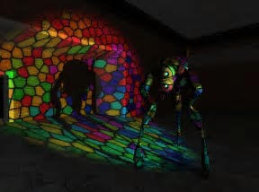

# Final Project

[CIS 565](https://cis565-fall-2017.github.io/): GPU Programming and Architecture

University of Pennsylvania

Fall 2017

The final project gives you an opportunity to embark on a large GPU programming endeavor of your choice.  You are free to select an area in graphics, GPU computing, or both.

You can
* fulfill **a real need in the community**,
* explore a new API,
* reproduce the results of recent research,
* add a novel extension to existing work, or
* implement something completely original.

Expect this to be 2-3x more work than the hardest project this semester.  The best projects will require a time commitment of at least 100 hours per student.  It will be worth it.

# Guidelines

* Form teams of two or three students.  Each team member will receive the same grade.  Teams of four will be considered, but will be expected to build something truly amazing like [this](https://github.com/ishaan13/PhotonMapper).  Teams of one are discouraged and will only be considered on a case-by-case basis.
* Use GitHub.  We encourage, but do not require, you to develop in a public repo as open source.
* Programming language, graphics and compute APIs, and target platforms are up to you.
* You are allowed to use existing code and libraries.  These should be prominently credited and your code should be easily identifiable.  Be incredibly clear about what is your work and what is not.

# Project Ideas

## WebGPU - Next-generation 3D Graphics on the Web

Background
* [Designing a Next-Gen Graphics API for the Web](https://docs.google.com/presentation/d/1Z_3-3V6FRsF8OJNeH7yc6UKtgXy90Ggff07V9Z6uo6U/edit#slide=id.g644e7765b4b81e56_540) by Kai Ninomiya
* https://github.com/google/nxt-standalone

Ideas
* glTF 2.0 PBR renderer for NXT
* Vulkan backend for NXT
* CUDA rasterizer backend for NXT
* Tensorflow operators using NXT compute shaders
* Anything to help with NXT design

## WebAssembly

http://webassembly.org/

* Prototype a graphics engine in C++/OpenGL ES and "compile" it for the web using WebAssembly.  Provide benchmarks.
* Answer the question: how can an existing JavaScript codebase use WebAssembly?  Rewrite the whole thing in C++?  Rewrite hot fine-grained modules, e.g., matrix and vector types?  Rewrite hot coarse-grained modules, e.g., the physics engine?

Also talk to Austin Eng, who is using WebAssembly for his Senior Design.

## glTF

https://www.khronos.org/gltf

Disclosure: I am chair of the Khronos 3D Formats Working Group. :smirk:

### Unity importer/exporter

https://github.com/KhronosGroup/UnityGLTF

Collaborate with Microsoft and Mozilla on the Unity glTF importer and exporter

### Autodesk Maya or Max importer or exporter

Develop an open-source Maya or Max plugin for glTF import or export

## WebGL

### WebGL 2

Extend 
* [WebGL 2 Samples Pack](https://github.com/WebGLSamples/WebGL2Samples) or
* [WebGL 2 Examples](https://github.com/tsherif/webgl2examples)

### WebGL vs. OpenGL ES Mobile Power Usage

On mobile, how does the power usage of JavaScript/WebGL compare to C++/OpenGL ES 2 (or Java/ES or Objective C/ES)?  For example, if the same app is developed in WebGL and OpenGL ES, which one drains the battery first - and why?  What type of benchmarks need to be developed, e.g., CPU bound, GPU compute bound, GPU memory bound, etc.?

### WebGL for Graphics Education

Create a tutorial using WebGL that teaches either basic _GPU architecture_ (parallelism, branches, multithreading, SIMD, etc.) or _Tile-Based Architectures_ like those used in mobile GPUs.  For inspiration, see [Making WebGL Dance](http://acko.net/files/fullfrontal/fullfrontal/webglmath/online.html) by Steven Wittens.

## gpu.js

https://github.com/gpujs/gpu.js

Build something with gpu.js:

> gpu.js is a JavaScript Acceleration library for GPGPU (General purpose computing on GPUs) in Javascript. gpu.js will automatically compile simple JavaScript functions into shader language and run them on the GPU.

## Cesium

https://cesiumjs.org/

3D Mapping WebGL Engine

Disclosure: I started this project. :smirk:

### Integration with three.js and other engines

Expand on https://cesium.com/blog/2017/10/23/integrating-cesium-with-threejs/ to fully explore integrating Cesium with other WebGL engines such as three.js and BabylonJS - both by overlaying two canvases and by combining the rendering loop.

### Ocean rendering

Improve the quality of the global-scale ocean/water rendering in Cesium.  Add any required WebGL 2 features to Cesium

Resources
* https://www.fxguide.com/featured/assassins-creed-iii-the-tech-behind-or-beneath-the-action/
* http://the-witness.net/news/2012/08/regarding-water/
* http://vterrain.org/Water/

### Snow rendering

Expand on the [particle system](https://cesiumjs.org/tutorials/Particle-Systems-Tutorial/) and new [terrain materials](https://github.com/AnalyticalGraphicsInc/cesium/pull/5919) to add snow rendering to Cesium.

http://vterrain.org/Atmosphere/rain.html

## BabylonJS

https://www.babylonjs.com/

Directly from the BabylonJS team:

* Support for light projection: https://github.com/BabylonJS/Babylon.js/issues/2771. The idea is to add a new property to spot light: projectedTexture. The goal is to enable this behavior:

* Other interesting topic: add a new Depth of Field post process: https://github.com/BabylonJS/Babylon.js/issues/2506  .We already support DoF but as part of an entire pipeline. The goal here is to extract it, make it better (with kernel blur) and make it simple and performant to use

* More postprocesses:
 * Better bloom
 * Cartoon
 * Paper
 * You name it :)

## Vulkan

### renderdoc

Contribute to [renderdoc](https://github.com/baldurk/renderdoc/wiki/Vulkan).

### In Defense of Batching

Does batching still help with Vulkan?  If so, when it is worth it?

### Domain-specific shading languages

Create a domain-specific shading language targeting SPIR-V.  Perhaps a language tuned for CSG, voxels, or ray marching.

### Utility library

Implement a new abstraction layer using Vulkan that is higher level than Vulkan, but lower level than, for example, Unity.

### Multithreaded Engine

Prototype a small engine with multithreading for LOD and culling.

### Tutorial Series

Write a _Vulkan for OpenGL developers_ tutorial series.

## VR

1. Performance analysis of porting an engine to VR
   * Naive stereo rendering vs. multi-view
2. Implement barrel distortion and chromatic aberration filters with optimizations
   * In practice, use filters from VR vendors to avoid making users sick
3. More precise object culling with a volume derived from the hidden area mesh
   * Is this practical and useful?
4. In each eye, most of the same fragments will pass the depth test, can this coherence be used to optimize?
   * Evaluate the checkerboard stencil in radial density masking as a general optimization
5. Does it have better visual quality than rendering a scene at half-resolution and upsampling with only a nominal cost?
   * Expand radial density masking / fixed foveated rendering to apply geometric/material LOD to objects in the periphery
6. Implement a simulation for avoiding judder
7. Compare async timewarp, spacewarp, and late orientation warping, and heuristics for selecting between them
8. Improve spacewarp with a sparse voxel octree
   * Not sure if this will work, but perhaps could improve occlusion artifacts at a reasonable performance and memory cost

## CUDA / GPU Computing

### 3D Machine Learning

3D Machine Learning = Computer Vision + Graphics + Machine Learning

* http://graphics.stanford.edu/courses/cs468-17-spring/
* https://github.com/timzhang642/3D-Machine-Learning

### Autonomous Cars

GPU accelerate parts of [autonomous cars](http://www.nvidia.com/object/drive-automotive-technology.html).

## Other

### Google Tango

Anything that runs in real-time using the GPU and the [Tango API](https://developers.google.com/tango/).

## Anti-Ideas

Please do not propose yet-another-CUDA-fluid/smoke/cloth simulation unless it has a unique spin such as using
* Vulkan compute shader
* NXT compute shader
* Multi-GPU
* A very sophisticated simulation

Likewise, please do not propose extend-my-CUDA-path-tracer-with-these-n-effects unless it is truly unique.

## Previous Semesters

For inspiration, browse the CIS 565 final projects from previous semesters: [Fall 2016](https://cis565-fall-2016.github.io/studentwork.html), [Fall 2015](http://cis565-fall-2015.github.io/studentwork.html), [Fall 2014](http://cis565-fall-2014.github.io/studentwork.html), [Fall 2013](http://cis565-fall-2013.github.io/studentwork.html), [Fall 2012](http://cis565-fall-2012.github.io/studentwork.html), [Spring 2012](http://cis565-spring-2012.github.com/studentwork.html), and [Spring 2011](http://www.seas.upenn.edu/~cis565/StudentWork-2011S.htm).

A guideline is that your project should be better than last semester's projects; that is how we move the field forward.

### Selected Projects

* **Fall 2016**
   * [Vulkan PBR Renderer](https://github.com/jian-ru/laugh_engine) by Jian Ru
   * [Vulkan Forward+ Renderer](https://github.com/WindyDarian/Vulkan-Forward-Plus-Renderer) by Ruoyu Fan and Xueyin Wan
   * [PIC/FLIP Fluid with WebGL](https://github.com/austinEng/WebGL-PIC-FLIP-Fluid) by Austin Eng
* **Fall 2015**
   * [Forward+ Renderer using OpenGL/Compute Shaders](https://github.com/bcrusco/Forward-Plus-Renderer) by Bradley Crusco and Megan Moore
   * [WebGL Fragment Shader Profiler](https://github.com/terrynsun/WebGL-Fragment-Shader-Profiler) by Sally Kong and Terry Sun
   * [GPU Cloth with OpenGL Compute Shaders](https://github.com/likangning93/GPU_cloth) by Gary Li
* **Fall 2014**
   * [Bidirectional Path Tracer in CUDA](https://github.com/paula18/Photon-Mapping) by Paula Huelin Merino and Robbie Cassidy
   * [GPU-Accelerated Dynamic Fracture in the Browser with WebCL](https://github.com/kainino0x/cis565final) by Kai Ninomiya and Jiatong He
   * [Uniform grid and kd-tree in CUDA](https://github.com/jeremynewlin/Accel) by Jeremy Newlin and Danny Rerucha
* **Fall 2013**
   * [Surface Mesh Reconstruction from RGBD Images](https://github.com/cboots/RGBD-to-Mesh) by Collin Boots and Dalton Banks
   * [Sparse Voxel Octree](https://github.com/otaku690/SparseVoxelOctree) by Cheng-Tso Lin
   * [Terrain tessellation](https://github.com/mchen15/Gaia) by Mikey Chen and Vimanyu Jain
   * [GPU Photon Mapper](https://github.com/ishaan13/PhotonMapper) by Ishaan Singh, Yingting Xiao, and Xiaoyan Zhu
* **Fall 2012**
   * [Non-photorealistic Rendering](http://gpuprojects.blogspot.com/) by Kong Ma
   * [Procedural Terrain](http://gputerrain.blogspot.com/) by Tiju Thomas
   * [KD Trees on the GPU](http://www.colorseffectscode.com/Projects/FinalProject.html) by Zakiuddin Shehzan Mohammed
* **Spring 2012**
   * [Single Pass Order Independent Transparency](http://gamerendering.blogspot.com/) by Sean Lilley
   * [GPU-Accelerated Logo Detection](http://erickboke.blogspot.com/) by Yu Luo
   * [GPU-Accelerated Simplified General Perturbation No. 4 (SGP4) Model](http://www.matthewahn.com/blog/sgp4-14558-satellites-in-orbit/) by Matthew Ahn
* **Spring 2011**
   * [Fast Pedestrian Recognition on the GPU](http://spevis.blogspot.com/) by Fan Deng
   * [Screen Space Fluid Rendering](http://fastfluids.blogspot.com/) by Terry Kaleas
   * [Deferred Shader with Screen Space Classification](http://smt565.blogspot.com/) by Sean Thomas

## Conferences and Journals

Browse these for ideas galore!

* [Journal of Computer Graphics Techniques](http://jcgt.org/read.html)
* [Advances in Real-Time Rendering](http://advances.realtimerendering.com/) SIGGRAPH courses
* [Ke-Sen Huang's conference pages](http://kesen.realtimerendering.com/) - papers from SIGGRAPH, Eurographics, I3D, and elsewhere
* [Real-Time Rendering Portal](http://www.realtimerendering.com/portal.html) and [WebGL Resources](http://www.realtimerendering.com/webgl.html) - links to an amazing amount of content

# Timeline

## **Monday 11/13** - Project Pitch

Sign up for a time slot ASAP.

Your project pitch is a 15-minute meeting with Patrick, Shehzan, and the TAs, and a write-up no longer than **one page** that includes an overview of your approach with **specific goals** and **weekly milestones** for 11/20, 11/27, 12/04, and 12/11.  First, focus on why there is a need for your project.  Then describe what exactly you are going to do.  In addition to your write-up, provide supplemental **figures**, **images**, or **videos**.

Think of your pitch as if you are trying to get a startup funded, convincing your company to start a new project, or responding to a grant.  For an example, see [Forward+ Renderer using OpenGL/Compute Shaders](https://github.com/bcrusco/Forward-Plus-Renderer/blob/master/Final%20Project%20Pitch.pdf) by Bradley Crusco and Megan Moore _(this example pitch does not include weekly milestones, which is new this semester)_.

**Before the meeting**:
* Email your one page pitch and any supplemental material to Patrick, Shehzan, and the TAs by end of Sunday 11/12.  Sooner is better.  To really hit a home run, consider prototyping something before the meeting.

**After the meeting**:
* Push your pitch to a new GitHub repo for your project
* Email the repo link to  cis-565-fall-2017@googlegroups.com (if the project is open source)

## **Monday 11/20** - Milestone 1

Your first presentation should be **5 minutes**.  Present your work-in-progress.  Your presentation should include a few slides, plus videos, screenshots, or demos if possible.  Be sure to
* Demonstrate working code (videos and screenshots are OK; it doesn’t have to be live).
* Provide a roadmap with future weekly milestones up to and including the final presentation on **Monday, December 11**.

See the Cesium [Presenter's Guide](https://github.com/AnalyticalGraphicsInc/cesium/tree/master/Documentation/Contributors/PresentersGuide#presenters-guide) for tips on presenting.  Be sure to present as a team; for a great example, see http://www.youtube.com/watch?v=OTCuYzAw31Y

After class, push your presentation to your GitHub repo.

## **Monday 11/27** - Milestone 2

A 5 minute presentation on your progress over the past week.  Demonstrate how you reached or exceeded the goals for this milestone.  If you didn't reach them, explain why.  Remind us of your upcoming milestones, and adjust them if needed.

After class, push your presentation to your GitHub repo.

## **Monday 12/04** - Milestone 3

Same format as Milestone 2.

## **Thursday 12/11** - Final Presentation

5-minute final presentation.

This should be a polished presentation with a 1-2 slide **overview** of the technical approach at a high-level of abstraction, followed by a **demo/video of the results** in different representative scenarios, followed by a careful **performance analysis**, and finally **shortcomings** of the approach.

It is OK to present this as a few slides with a demo/video for the results section, or to prepare a video for the entire presentation and then talk to the video as your presentation.

Please practice for timing; do not exceed five minutes.

By 6pm:
* Push the following to GitHub
   * Final presentation slides/video
   * Final code - should be clean, documented, and tested
* A detailed README.md including:
   * Name of your project
   * Your names and links to your website/LinkedIn/twitter/whatever
   * Choice screenshots including debug views
   * Link to demo if possible.  WebGL demos should include your names and a link back to your github repo
   * Overview of technique and links to references
   * Link to video
   * Detailed performance analysis
   * Install and build instructions

As always, see [How to make an attractive GitHub repo](https://github.com/pjcozzi/Articles/blob/master/CIS565/GitHubRepo/README.md#how-to-make-an-attractive-github-repo) for tips on your README.md.

# Grading

The final project is worth 50% of your final grade.  The breakdown is:

* Milestone 1: 25%
* Milestone 2: 25%
* Milestone 3: 25%
* Final Presentation: 25%
