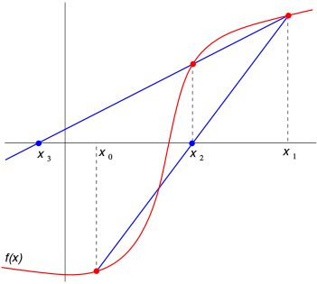
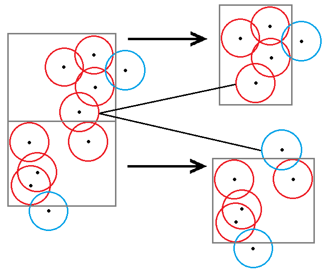

# Cloudy with a Chance of Metaballs

Authors:
[Sarah Forcier](https://github.com/sarahforcier), 
[Charles Wang](https://github.com/charlesliwang)

## Overview
Metaballs are a fun way to create interesting geometries or simulate deformation or fluids. However, their isosurface representation is difficult to calculate in real time. One such method uses the marching cube algorithm to tessellate the surface, but this scales poorly for an increasing number of metaballs or for high resolution because it requires voxelization of the space. We aim to achieve speedup by keeping the metaballs in implicit form and using a modified bounding volume hierarchy as described by Gourmel et al. (Siggraph 2009). Along with a BVH structure, this method describes a fast approach to finding a ray-isosurface intersection that avoids slow ray marching. The BVH is computed on the CPU, but the rendering will be performed with CUDA on the GPU with BVH nodes and metaball information stored as textures. Once we render metaballs in real time, we want to demonstrate the benefits of this method by implementing fresnel reflection and refraction and ambient occlusion. 

## Goals
* Secant Method and Dichotomic Search for ray-isosurface intersection
* Modified Bounding Volume Hierarchy
* Reflection and Refraction
* Ambient Occlusion

## Milestone November 20, 2017
Path tracing and ray-isosurface intersection (visualization of metaballs)

## Milestone November 27, 2017

## Milestone December 4, 2017
TODO: Implement reflective and refractive materials

## Milestone December 11, 2017
TODO: add ambient occlusion and design snazzy scenes

## References
1. O. Gourmel, A. Pajot, M. Paulin, L. Barthe, P. Poulin. [Fitted BVH for Fast Raytracing of Metaballs](http://www.ligum.umontreal.ca/Gourmel-2010-FBVH/Gourmel-2010-FBVH.pdf). EUROGRAPHICS, 2009
2. O. Gourmel, A. Pajot, L. Barthe, M. Paulin, P. Poulin. [BVH for efficient raytracing of dynamic metaballs on GPU](https://dl.acm.org/citation.cfm?id=1598041). SIGGRAPH, 2009
3. Y. Kanamori, Z. Szego, T. Nishita. [GPU-based Fast Ray Casting for a Large Number of Metaballs](http://kanamori.cs.tsukuba.ac.jp/projects/metaball/eg08_metaballs.pdf). EUROGRAPHICS, 2008
4. L. Szecsi, D. Illes. [Real-Time Metaball Ray Casting with Fragment Lists](http://cg.iit.bme.hu/~szecsi/cikkek/metaball12/meta.pdf). EUROGRAPHICS, 2012
5. Jay McKee, AMD, [Real-Time Concurrent Linked List Construction on the GPU](http://developer.amd.com/wordpress/media/2013/06/2041_final.pdf)