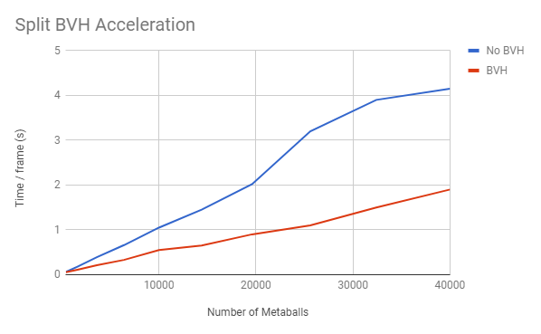
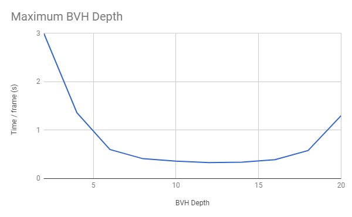

# Cloudy with a Chance of Metaballs

Authors:
[Sarah Forcier](https://github.com/sarahforcier), 
[Charles Wang](https://github.com/charlesliwang)

## Overview
Metaballs are a fun way to create interesting geometries or simulate deformation or fluids. However, their isosurface representation is difficult to calculate in real time. One such method uses the marching cube algorithm to tessellate the surface, but this scales poorly for an increasing number of metaballs or for high resolution because it requires voxelization of the space. We aim to achieve speedup by keeping the metaballs in implicit form and using a modified bounding volume hierarchy as described by Gourmel et al. (Siggraph 2009). Along with a BVH structure, this method describes a fast approach to finding a ray-isosurface intersection that avoids slow ray marching. The BVH is computed on the CPU, but the rendering will be performed with CUDA on the GPU with BVH nodes and metaball information stored as textures. Once we render metaballs in real time, we want to demonstrate the benefits of this method by implementing fresnel reflection and refraction and ambient occlusion. 

## Features
* Secant Method for ray-isosurface intersection
* Fitted BVH with Split Nodes
* Environment Map with Reflection
* Cool Tornado Demo Scene!

### Secant Method

Rather than raymarching through the scene, we use the secant method to find a "root" at the surface of the metaball. In order to find the first interval, we find the first metaball intersection projection with a positive (f(x)) value. Because we can assume that the metaball density at the camera is negative, we iterate along a slope to coverge towards a density of 0.

 \
Example diagram illustrating the secant method (from wikipedia)

**Concurrent Linked List**

When using the secant method, we must find the first intersection projection with a positive metaball density. This allows us to keep track of all of the metaballs intersected, such that for each ray, we have a list of metaballs that contribute to the overall density.

### Fitted BVH with Split Nodes

The general structure of our modified BVH structure for metaballs follows a standard BVH for geometry with a couple major differences. First, each BVH leaf node contains not only the metaballs contained in its bounding box, but also a list of "split metaballs" - metaballs that overlap the bounding box but are not completely contained. This means that they may have some influence on the metaballs inside the bounding box, but are not fully encapsulated. Our BVH structure is also a fitted BVH structure where no two BVH nodes overlap. This helps to reduce the number of redundant bounding box intersection tests.

 \
Example diagram illustrating split metaballs in blue

**Indexing Metaballs and BVH**

With a GPU implementation, BVH nodes cannot contain a dynamic array of pointers to metaballs. Instead, we reorder metaballs in memory by their BVH leaf node IDs and each BVH keeps track of a start and end index to access their metaballs.

 \
The metaball and bvh data may be ordered something like this

**Indexing Split Metaballs**

Metaballs must be duplicated for split metaballs because they may affect metaballs in other bvh leaf nodes. To store these, we have to put a cap on the total number of split metaballs. We know that only leaf nodes contain split metaballs and that the maximum number of leaf nodes is the number of nodes at max depth. The total number of split nodes is then MAX_PER_LEAF * NUM_NODES_AT_MAX_DEPTH. Some nodes are leaf nodes, but not at the max depths, so we index them in the final array by cascading it down and finding that index in the max depth only array.

 \
The leaf node in red will be indexed to a corresponding node at max depth for storing split metaballs

### Optimizations

**Streams CPU and GPU Overlap**

Our BVH tree construction takes place on the CPU, because using dynamic arrays to pass down split metaballs data to child nodes is more convenient. Though a CPU construction algorithm may be slower than a GPU construction algorithm, we can take advantage of CPU and GPU overlap to hide the cost of our construction process. By executing the BVH construction command immediately after our intersection test kernel (our most expensive kernel) and synchronizing afterwards, the CPU and GPU commands run in parallel, reducing the overall computation time per frame.

## Performance Analysis

Our BVH acceleration structure achieves speed up depending on the scene. As the number of metaballs increases, the speed up is about 2 times faster.

As the maximum depth increases, the tree traversal narrows the number of metaballs needed to determine intersection, thus speeding up the simulation. However, with a larger depth, more memory is required to store the BVH on the GPU. 

Similarly to the slow down associated with a large max BVH depth, allocating a lot of memory for the split nodes also slows down the simulation.

## Install and Build Instructions

1. In Git Bash, navigate to your cloned project directory.
2. Create a `build` directory: `mkdir build`
   * (This "out-of-source" build makes it easy to delete the `build` directory
     and try again if something goes wrong with the configuration.)
3. Navigate into that directory: `cd build`
4. Open the CMake GUI to configure the project:
   * `cmake-gui ..` or `"C:\Program Files (x86)\cmake\bin\cmake-gui.exe" ..`
   * Click *Configure*.  Select your version of Visual Studio, Win64.
     (**NOTE:** you must use Win64, as we don't provide libraries for Win32.)
   * If you see an error like `CUDA_SDK_ROOT_DIR-NOTFOUND`,
     set `CUDA_SDK_ROOT_DIR` to your CUDA install path. This will be something
     like: `C:/Program Files/NVIDIA GPU Computing Toolkit/CUDA/v7.5`
   * Click *Generate*.
5. If generation was successful, there should now be a Visual Studio solution
   (`.sln`) file in the `build` directory that you just created. Open this.
   (from the command line: `explorer *.sln`)
6. Build. (Note that there are Debug and Release configuration options.)
7. Run. Make sure you run the `metaball_path_tracer` target (not `ALL_BUILD`) by
   right-clicking it and selecting "Set as StartUp Project".
   * If you have switchable graphics (NVIDIA Optimus), you may need to force
     your program to run with only the NVIDIA card. In NVIDIA Control Panel,
     under "Manage 3D Settings," set "Multi-display/Mixed GPU acceleration"
     to "Single display performance mode".

## Milestone November 20, 2017
Path tracing and ray-isosurface intersection (visualization of metaballs)

## Milestone November 27, 2017

## Milestone December 4, 2017

## Milestone December 11, 2017
[Presentation](https://docs.google.com/presentation/d/1VnP5PpfE1NoT5oBOMwDdIdm3YqI9jJFYead3t_LEBN4/edit?usp=sharing)

## References
1. O. Gourmel, A. Pajot, M. Paulin, L. Barthe, P. Poulin. [Fitted BVH for Fast Raytracing of Metaballs](http://www.ligum.umontreal.ca/Gourmel-2010-FBVH/Gourmel-2010-FBVH.pdf). EUROGRAPHICS, 2009
2. O. Gourmel, A. Pajot, L. Barthe, M. Paulin, P. Poulin. [BVH for efficient raytracing of dynamic metaballs on GPU](https://dl.acm.org/citation.cfm?id=1598041). SIGGRAPH, 2009
3. Y. Kanamori, Z. Szego, T. Nishita. [GPU-based Fast Ray Casting for a Large Number of Metaballs](http://kanamori.cs.tsukuba.ac.jp/projects/metaball/eg08_metaballs.pdf). EUROGRAPHICS, 2008
4. L. Szecsi, D. Illes. [Real-Time Metaball Ray Casting with Fragment Lists](http://cg.iit.bme.hu/~szecsi/cikkek/metaball12/meta.pdf). EUROGRAPHICS, 2012
5. Jay McKee, AMD, [Real-Time Concurrent Linked List Construction on the GPU](http://developer.amd.com/wordpress/media/2013/06/2041_final.pdf)
